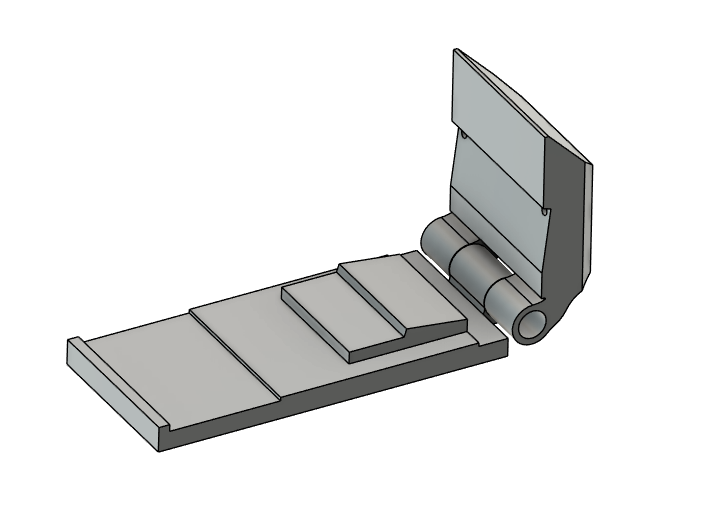
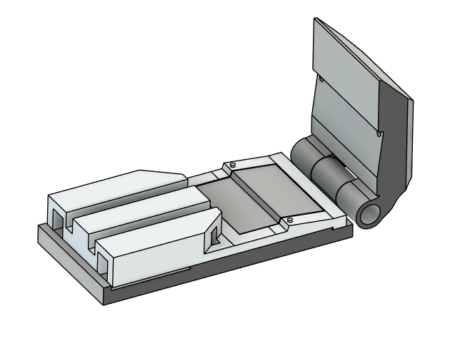
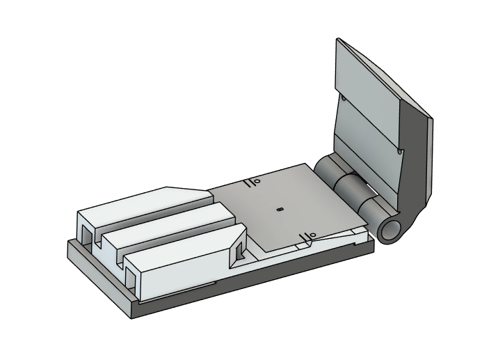
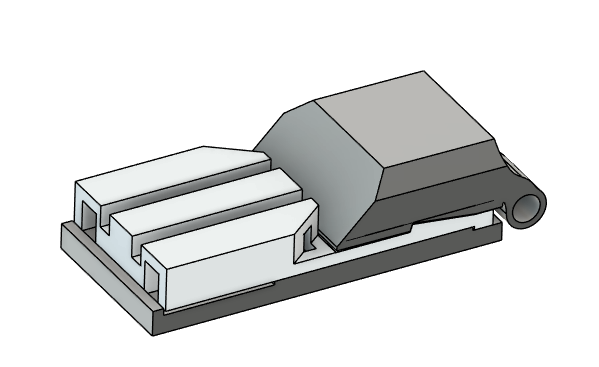

# Fly Holder Assembly Jig

This folder contains jig components for assembling fly holders. The parts were manufactured on a Formlabs Form 4BL SLA 3D printer using Gray resin at a layer resolution of 0.025 mm.

Two jig orientations are provided:

- `Backward_Orientation`
- `Forward_Orientation`

The experimenter can select the orientation that best matches the holder model and assembly workflow being used.

The foil used with this jig is documented in the [Foil design](../Foil%20design) folder.

## Printing Notes

- The ready-to-print setup files are the `.form` files:
  - `Backward_Orientation/Backward_printing_file.form`
  - `Forward_Orientation/Forward_printing_file.form`
- Print the jig components at 0.025 mm layer resolution.
- The position of the holders during printing is important. Support placement can affect the final alignment of the device, especially on surfaces that guide or register the holder during assembly. When preparing the print, avoid placing supports on critical alignment faces whenever possible.

## Cleaning and Curing

After printing, rinse the parts in isopropyl alcohol to remove uncured resin, then allow them to dry completely before curing. Cure the parts according to the resin manufacturer's recommendations for Gray material. Remove supports carefully after cleaning and curing, paying special attention to alignment surfaces and small features.

For the holder pieces, lightly sand the areas where support material was attached. This helps remove residual support marks and allows the holder to slide more smoothly into the assembly jig.

Once the pieces are clean, dry, fully cured, and sanded where needed, proceed with assembly.

## Assembly Procedure

1. Select the jig orientation that matches the model you want to assemble.

2. Place the holder or dissection chamber inside the assembly jig.

3. Cut the foil to the size required for the selected fly holder, using the design files in the [Foil design](../Foil%20design) folder as reference. Place the foil over the holder, align the perforated holes with the holder, and apply a small drop of cyanoacrylate glue, such as Crazy Glue, to each hole.

4. Close the jig. This locks the foil position and creates the bends exactly where they are needed.

5. Once the foil is correctly positioned and fixed to the holder, apply epoxy around the foil edges. This seals the interface and helps prevent leaks, since liquid will be placed inside the holder during use.

6. Cure the epoxy according to the manufacturer's instructions.

7. After the epoxy is fully cured, the assembled holder is ready to use.
## License

This design folder is licensed under the CERN Open Hardware Licence Version 2 - Permissive (CERN-OHL-P-2.0). See [LICENSE](LICENSE) for the full license text.

