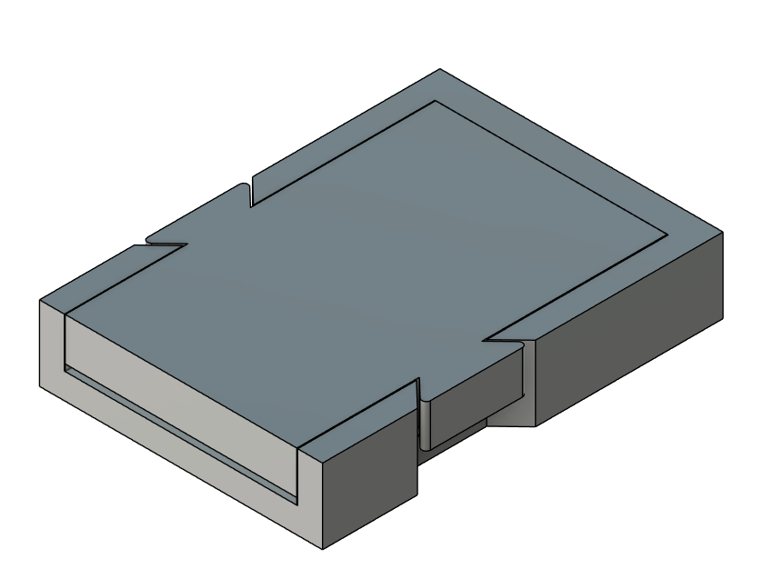
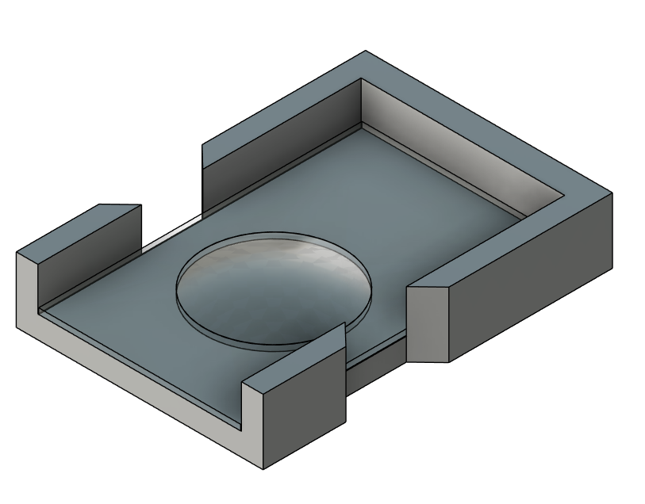
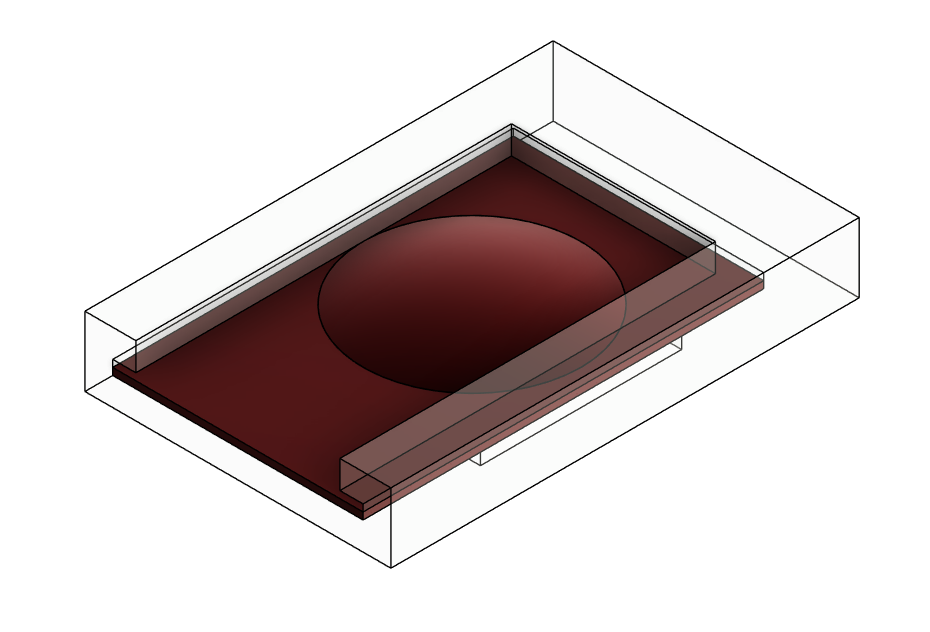

# Fly Lids

## Materials

- Clear easy-to-form PETG sheet, 6 in x 6 in x 1/8 in.
- Reference material: [McMaster-Carr 85815K114](https://eprocurement.mcmaster.com/85815K114/?publication=ecmrc&pnchstp=2&combine_content=true).
- Water-resistant sandpaper.

## Mold Preparation

1. Print the mold pieces at 0.025 mm layer resolution, using the highest available resolution for the printer.

2. Wash the printed mold pieces to remove uncured resin.

3. Cure the pieces according to the resin manufacturer's recommendations.

4. Once the parts are fully cured, use water-resistant sandpaper to smooth the cup area of the mold. This step helps remove visible layer lines from the print and produces a more uniform surface for shaping the PETG.

## PETG Lid Forming

1. Print the cutting template from the provided Adobe Illustrator file (`PETG-design-lids.ai`).

2. Cut the PETG sheet according to the template.

3. Once each plastic piece has been cut to the correct size, clean the surface of `Fly_lid_PETG_mold_p1.stl` and place the PETG on top of it.

4. Use a heat gun to gradually soften the PETG in the curved area. Apply heat slowly and evenly to avoid burning, warping, or overheating the material.

5. Once the PETG has softened, press it into shape using `Fly_lid_PETG_mold_p2.stl`.

6. Hold the mold in position until the PETG cools completely and keeps its shape.

7. If the final shape is not uniform, repeat the heating and pressing process as needed.

<!-- IMAGE_GALLERY_START -->
## Image Gallery

The images below provide a quick visual reference for the files in this folder.

### Fly Lid PETG Mold

### Fly Lid PETG Mold Interior

### Fly Stage for Lids

<!-- IMAGE_GALLERY_END -->
