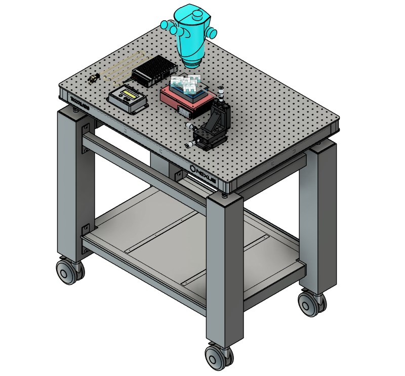
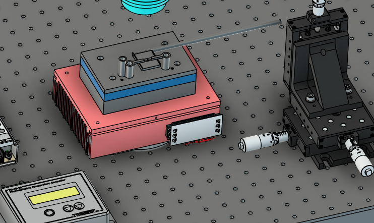
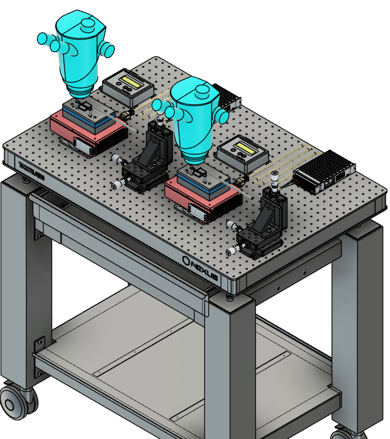

# Peltier Station

This folder contains CAD files and reference images for a Peltier-based station used with fly holders. The design provides a working platform for positioning the fly holder over a temperature-controlled Peltier module while keeping the surrounding setup accessible for imaging, manipulation, and alignment.

## Files

- `base-peltrier-station.step`: editable CAD model for the station base.
- `base-peltrier-station.stl`: mesh file for manufacturing the station base.
- `Fly-Holder-peltrier-station.step`: editable CAD model for the fly holder interface.
- `Fly-Holder-peltrier-station.stl`: mesh file for manufacturing the fly holder interface.
- `peltrier-station-new_prices_only.xlsx`: price list / bill of materials reference for the station components.

## Design Preview

<table>
  <tr>
    <td align="center"> Station overview</td>
    <td align="center"> Peltier and holder detail</td>
    <td align="center"> Dual station layout</td>
  </tr>
</table>

## Manufacturing Notes

Use the `.step` files when the design needs to be edited or adapted before fabrication. Use the `.stl` files when preparing the parts for 3D printing or mesh-based manufacturing.

Before manufacturing, inspect the CAD model orientation, mounting surfaces, and holder interface features. Support placement should avoid critical alignment faces whenever possible, especially where the fly holder seats into the station.

After fabrication, clean the parts according to the manufacturing method used. For resin 3D printed parts, remove uncured resin, fully dry the parts, cure them according to the material recommendations, and remove supports carefully. Light sanding may be useful on support contact areas or sliding interfaces if the holder fit is tight.

## License

This design folder is licensed under the CERN Open Hardware Licence Version 2 - Permissive (CERN-OHL-P-2.0). See [LICENSE](LICENSE) for the full license text.
